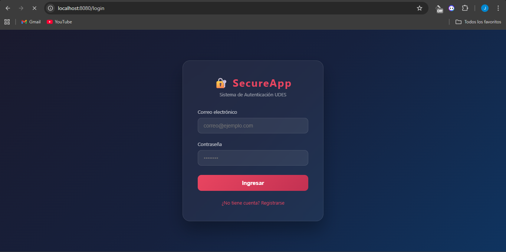
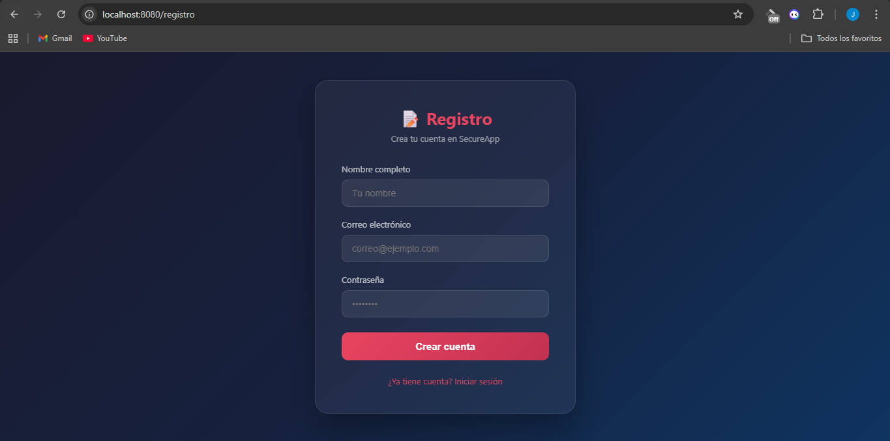
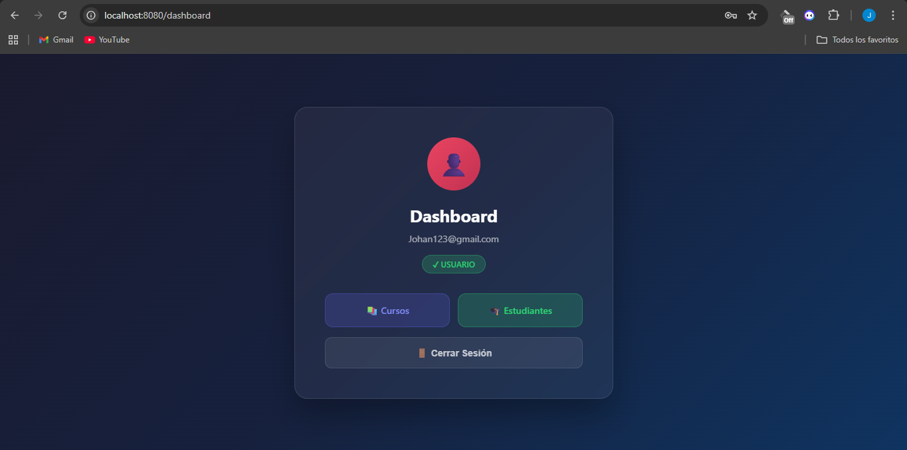
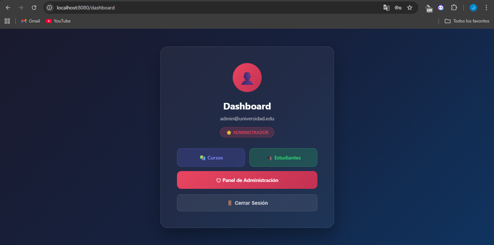
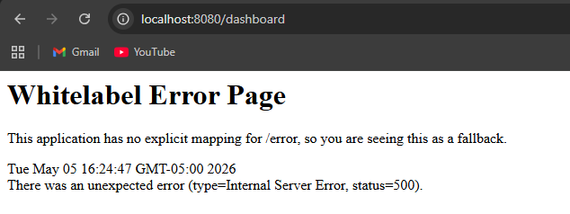

# Carreño-post1-u9 — Seguridad en Aplicaciones Web

Sistema de autenticación completo con Spring Security 6, BCrypt, roles diferenciados y rutas protegidas.

---

## Tecnologías utilizadas

- Java 17
- Spring Boot 3.2.5
- Spring Security 6
- Spring Data JPA + Hibernate
- MySQL 8
- Thymeleaf + thymeleaf-extras-springsecurity6
- BCryptPasswordEncoder (strength 12)

---

## Configuración de MySQL

1. Tener MySQL corriendo en `localhost:3306`
2. Crear la base de datos:

```sql
CREATE DATABASE IF NOT EXISTS estudiantes_db;
```

3. Configurar credenciales en `src/main/resources/application.properties`:

```properties
spring.datasource.url=jdbc:mysql://localhost:3306/estudiantes_db
spring.datasource.username=root
spring.datasource.password=TU_CONTRASEÑA
```

4. Insertar el usuario ADMIN manualmente en MySQL:

```sql
USE estudiantes_db;
INSERT INTO usuarios (nombre, email, contrasenia, rol, activo)
VALUES ('Administrador', 'admin@universidad.edu',
'$2a$12$uBiyXkLH9xiZtec91wnQveouTAqPMvvOoSunwzR6PZQuzQYA0ejM2', 'ROLE_ADMIN', 1);
```

---

## Ejecutar el proyecto

```bash
.\mvnw.cmd spring-boot:run
```

Abrir en el navegador: `http://localhost:8080/login`

---

## Usuarios de prueba

| Rol   | Email                     | Contraseña  |
|-------|---------------------------|-------------|
| USER  | johan123@gmail.com        | 12345678    |
| ADMIN | admin@universidad.edu     | admin123    |

---

## Rutas protegidas

| Ruta          | Acceso            |
|---------------|-------------------|
| `/login`      | Público           |
| `/registro`   | Público           |
| `/dashboard`  | Autenticado       |
| `/cursos/**`  | Autenticado       |
| `/estudiantes/**` | Autenticado   |
| `/admin/**`   | Solo ADMIN        |

---

## Capturas de pantalla

### Formulario de Login


### Registro de nuevo usuario


### Dashboard Usuario (ROLE_USER)


### Panel de Administración (ROLE_ADMIN)


### Error 403 — Acceso denegado


---

## Estructura del proyecto
src/main/java/com/universidad/estudiantes/
├── config/
│   └── SecurityConfig.java
├── controller/
│   ├── AuthController.java
│   ├── CursoController.java
│   └── EstudianteController.java
├── model/
│   ├── Usuario.java
│   ├── Curso.java
│   └── Estudiante.java
├── repository/
│   ├── UsuarioRepository.java
│   ├── CursoRepository.java
│   └── EstudianteRepository.java
└── service/
├── UsuarioService.java
├── UsuarioDetailsService.java
├── CursoService.java
└── EstudianteService.java